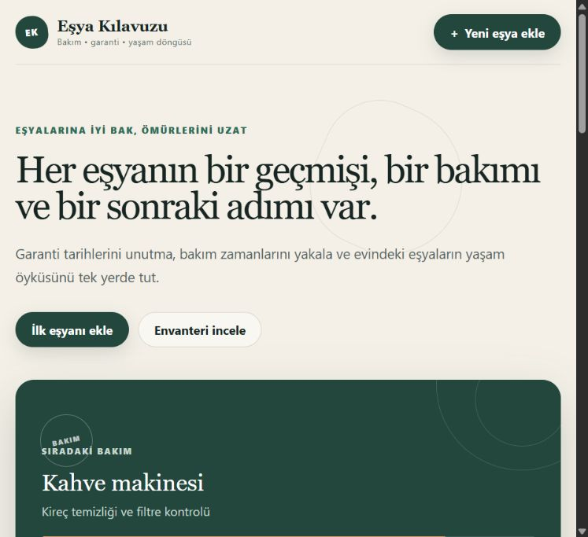

# Eşya Kılavuzu

Eşya Kılavuzu; evdeki eşyaların garanti, bakım, konum ve kullanım bilgilerini tek yerde tutmaya yarayan bir React uygulamasıdır. Proje, eşyaların ömrünü uzatmayı ve gereksiz tüketimi azaltmayı hedefler.

## Canlı proje

[Eşya Kılavuzu'nu Netlify üzerinde aç](https://esya-kilavuzu-busra.netlify.app)

## Özellikler

- Yeni eşya ekleme
- Eşyaları listeleme
- Eşya bilgilerini güncelleme
- Silme onayıyla eşya silme
- LocalStorage ile tarayıcıda kalıcı kayıt
- Ada, markaya, modele ve konuma göre arama
- Kategori ve kullanım durumuna göre filtreleme
- Tarih ve ada göre sıralama
- Garanti ve bakım durumlarını otomatik hesaplama
- Dinamik özet kartları
- Form doğrulama ve kullanıcı bildirimleri
- Telefon, tablet ve bilgisayara uyumlu tasarım
- Erişilebilir form etiketleri ve klavye odağı

## Kullanılan teknolojiler

- React
- TypeScript
- Vite
- Pure CSS
- Web Storage API (LocalStorage)
- Git ve GitHub
- Netlify

## CRUD karşılıkları

- **Create / Ekle:** Yeni eşya pasaportu oluşturulur.
- **Read / Listele:** Kayıtlı eşyalar kartlar halinde gösterilir.
- **Update / Güncelle:** Eşyanın tüm bilgileri düzenlenebilir.
- **Delete / Sil:** Onay penceresinden sonra kayıt kaldırılır.

## Proje klasörleri

```text
app/
├── Components/
│   ├── AppHeader.tsx
│   ├── EmptyState.tsx
│   ├── FilterBar.tsx
│   ├── ItemCard.tsx
│   ├── ItemForm.tsx
│   └── StatsPanel.tsx
├── Interfaces/
│   └── item.ts
├── Pages/
│   └── GuidePage.tsx
└── globals.css
public/
└── screenshots/
    └── esya-kilavuzu-ana-ekran.png
src/
├── main.tsx
└── vite-env.d.ts
index.html
netlify.toml
package.json
tsconfig.json
vite.config.ts
```

## Bilgisayarda çalıştırma

Güncel Node.js sürümü kurulduktan sonra proje klasöründe:

```bash
npm install
npm run dev
```

Terminalde gösterilen yerel adres tarayıcıda açılır.

## Üretim kontrolü

```bash
npm run build
```

Build başarılı olmadan proje teslim edilmemelidir.

## Ekran görüntüsü



## Veri saklama

Kayıtlar `esya-kilavuzu-items-v1` anahtarıyla kullanıcının tarayıcısındaki LocalStorage alanında tutulur. Veriler yalnızca kullanılan tarayıcı ve cihazda bulunur. Tarayıcı verileri temizlenirse kayıtlar silinir.

## Teslim kontrol listesi

- [x] React kütüphanesi kullanıldı.
- [x] Proje IDE ile açılabilir.
- [x] Components, Pages ve Interfaces klasörleri oluşturuldu.
- [x] Pure CSS kullanıldı.
- [x] Ekleme işlemi yapıldı.
- [x] Listeleme işlemi yapıldı.
- [x] Güncelleme işlemi yapıldı.
- [x] Silme işlemi yapıldı.
- [x] LocalStorage kullanıldı.
- [x] En az bir ekran görüntüsü README'ye eklendi.
- [x] Proje public GitHub deposuna gönderildi.
- [ ] GitHub bağlantısı teslim formuna yazıldı.
- [x] Proje Netlify üzerinde yayımlandı.
- [ ] Canlı bağlantı teslim formuna yazıldı.
